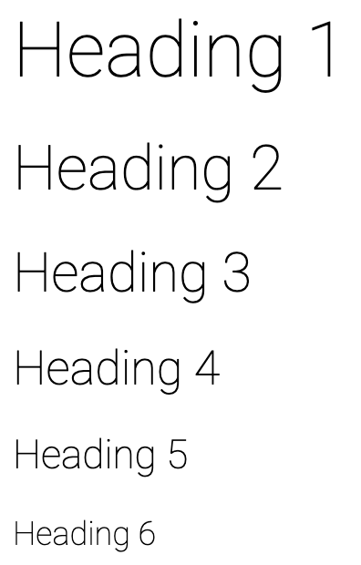
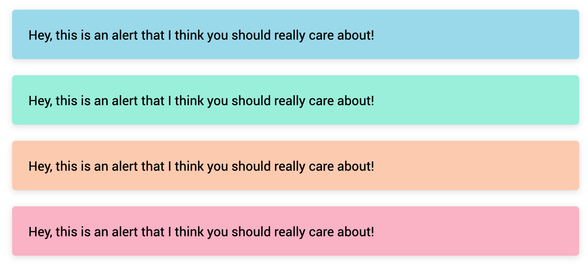

# Birchtree.css

Mocking up simple personal pages or test sites for your business typically mean using zero, to close to zero styling, and moving on because "it’s just a test site, who cares?" Oh, and these pages usually look like trash on mobile. This is all reasonable, it doesn’t need to be this way!

Birchtree.css is a small CSS package you can use to make those sites look good with very little effort. You could use this for a full, public website, but it’s lacking a ton of features, so you’d have to build all that out yourself.

Yes, something like Bootstrap does this, but (a) I don't love how Bootstrap looks out of the box, and (b) our aim is to have as little code as possible. Just because I don't see the extent of Bootstrap, doesn't mean it's not overkill for some things.

# Usage

Think of this like Bootstrap, but way simpler and way smaller. You use some basic HTML formatting and class names to style everything from form inputs to buttons to headers and more.

# Step 1: Import birchtree.css

In your HTML or PHP file, load the CSS file.

```html
<link rel="stylesheet" src="birchtree.css">
```

# Step 2: Use the below formatting to get the styles.

## Contents

* [Layout](#layout)
* [Form Inputs](#form-inputs)
* [Buttons](#buttons)
* [Headings](#headings)
* [Information Wells](#information-wells)
* [Alerts](#alerts)
* [Labels](#labels)
* [Navigation Bars](#navigation-bars)

## Layout

This ain’t Bootstrap, so don’t look to this to do advanced styling for you, but you can use the <code>container</code> class to hold all parts of your page. This simply constrains the width and centers everything on the page.

```html
<div class="container">
    { test page content }
</div>
```

## Form Inputs

The building block of almost any test page, form inputs are easily laid out.

**Text**


```html
<div class="input input-text">
    <span class="input-label">Email Address</span>
    <input class="input-field" type="text" placeholder="someone@example.com" name="email" value="">
</div>
```

You can also make larger text fields by adding the <code>input-mega</code> class to the <code>input-text</code> element.


```html
<div class="input input-text input-mega">
    <span class="input-label">Large Text Field</span>
    <input class="input-field" type="text" placeholder="someone@example.com" name="email">
</div>
```

**Checkbox**


```html
<div class="input input-chckbox">
    <input type="checkbox"> <span class="input-label">Checkbox Stuff</span>
</div>
```

**Select**


```html
<div class="input input-select">
    <select class="input-dropdown">
        <option value="">— Select An Option —</option>
        <option value="1">One</option>
        <option value="2">Two</option>
        <option value="3">Three</option>
    </select>
</div>
```

**File Upload**


```html
<div class="input input-upload">
    <label class="input-label" for="file-upload">Upload a file</label>
    <input type="file" class="file-upload" id="file-upload">
</div>
```

## Buttons


Rendering a basic button is simple.

```html
<button class="btn">Pay Now</button>
```

If you need a different type of button, you can add one of 5 other classes to get different styles.

```html
<button class="btn btn-danger">Danger</button>
```

All options include:

* <code>btn-submit</code>
* <code>btn-warning</code>
* <code>btn-danger</code>
* <code>btn-dark</code>
* <code>btn-light</code>

Buttons can be made larger or smaller if you’d like, using <code>btn-sm</code> or <code>btn-mega</code>

```html
<button class="btn btn-submit btn-sm">Confirm, Do the Thing</button>
<button class="btn btn-danger btn-mega">Warning, Please Confirm This</button>
```

## Headings



There is nothing special to do here, Birchtree.css simply makes some small adjustments to heading designs.

```html
<h1>This is a heading with style</h1>
```

Oh, and try using the class <code>site-title</code> to make your page’s name pop even more.

```html
<span class="site-title">Page Title</span>
```

## Information Wells


Typically used for instructional text.

```html
<div class="well">
    Paragraph of text goes here.
</div>
```

## Alerts



Much like a well, these are call outs you can use to show success or error messages, or whatever you want, really.

```html
<div class="alert">
    Hey, this is an alert that I think you should really care about!
</div>
```

Much like buttons, this creates a blue alert, and there are some alternate styles you can pick from:

* <code>alert-success</code>
* <code>alert-warning</code>
* <code>alert-danger</code>

```html
<div class="alert alert-success">
    Hey, this is an alert that I think you should really care about!
</div>
```

## Labels


If you need to put a badge/label next to something to call it out, labels let you do this.

```html
<p>Item <span class="label">Badge</span></p>
```

Labels will resize based on the size of their parent element, so the above example will be pretty small, but a label on an <code>h1</code> will be much bigger.

Again, there are a few colors to choose from.

* <code>label-success</code>
* <code>label-warning</code>
* <code>label-danger</code>

```html
<p>Item <span class="label label-danger">Badge</span></p>
```

## Navigation Bars


If you want to link to a few other pages, use the navigation bar element to make nicer links to your other pages.

```html
<div class="nav">
    <div class="nav-item active" aria-current="page">Home</div>
    <div class="nav-item"><a href="https://google.com" target="_blank">Google</a></div>
    <div class="nav-item"><a href="https://github.com" target="_blank">GitHub</a></div>
</div>
```

The default is to center the menu items, but you can left or right-justify them using:


```html
<div class="nav nav-left">
    { nav items }
</div>
```


```html
<div class="nav nav-right">
    { nav items }
</div>
```

Also, there is an option to throw a subtle shadow under the navigation to add a little separation.

```html
<div class="nav nav-shadow">
    { nav items }
</div>
```


